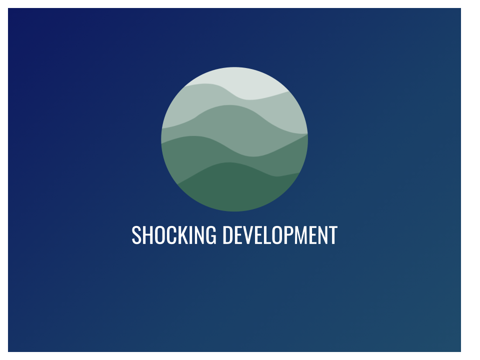

“ *Anyone who has never made a mistake has never tried anything new.* ” ― Albert Einstein

## The Team
Working in a group is always a great learning experience. You learn how to work with different people and different dynamics. It was my first time working in a large group completely online. The name of our team was Shocking Development and the group consisted of eight members Shin Saito, Matthew Kirts, Kyra Ikeda, Christian Jensen, Trey Sumida, Ted Galway-Severtson, and Jerome Gallego.

## The Goal
We were given the prompt of making a web application for HEI, specifically our client was Creighton Liu from HEI. Creighton wanted us to make a GHG tracker that showed the user savings based on their choice of transportation. The prompt was very much an open concept, we had creative control of the design of the UI, and with our goal out of the way we started on the mockups for the website. 

## The Mockup
Making a mockup of the website was challenging. I had no creative direction of what the client wanted the website to look like, so I had to find creative inspiration from other websites. One of the websites that I found creative inspiration was from the Plex website. I particularly liked the format of the navbar and the boxes, so I tried to translate that into my mockup of the landing page. As a group we chose blue and green as a color scheme. Although I have never created a website like this before I decided to take the risk since I wanted to learn as much as I could this semester. I was ready to challenge myself to create something a little more harder. A full documentation of our project can be found here https://shocking-development.github.io/. 

## Communication 
Communication was definitely one of the more difficult things to manage. We decided to conduct most of our meetings through discord. Initially we didn’t have designated group meetings, so for the first two milestones our group struggled with communication. For example, some of the group members did not know what to work on since it wasn’t communicated and others just decided to make issues and work on it themselves. Although this worked for the first milestone since we were not working on the actual project this became an issue later on during milestone 2. Eventually, we designated a time and day to meet which was usually Wednesday and Saturday at 7 pm or 8 pm. This definitely remedied some of the issues such as task management and direction, but it did not solve all of the issues with the online format.

## Helping Others  
Helping other group members was definitely a struggle since I could not be there physically to help them with their issue. Although we could cast our screen on discord, sometimes technical issues would waste time getting to the actual problem. Many times we would have to stop the screen cast and re-cast since the quality was horrible.

## Tasks
I think the online format definitely made it difficult for the members of my group to communicate everything that was on their plate. Sometimes tasks would go unfinished for an extended period of time because of the other obligations they had, although this was understandable it made it difficult to get started on bigger components of the project that were dependent on smaller tasks to be finished. Eventually I just finished those components myself because it needed to be done. However, I later learned that it's better to just finish your own issues to the best of your ability instead of finishing other people’s issues.

## The Experience
This project was definitely a new and challenging learning experience. However, I am grateful for the experience since I was able to learn so much and build upon my skills. I can definitely say that this experience allowed me to become more confident in my abilities.
