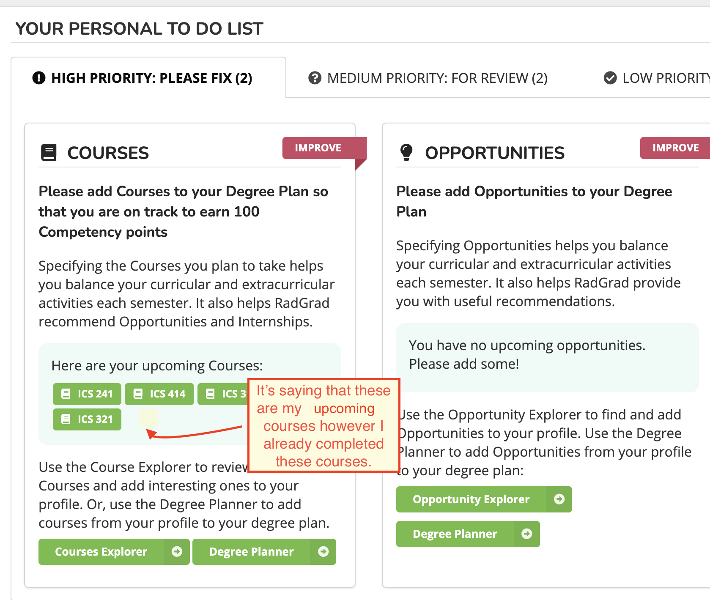

## RadGrad Strengths
Personally these are the three biggest strengths of Radgrad that I found while using the system:
* It provides the student/user with most and if not all of the things they need to build their portfolio/skills. (A one stop shop)

RadGrad provides students with reviews of courses, an academic planner, and opportunities such as internships tailored to their interests. I think that RadGrad minimizes the need to google reviews on courses and opportunities. It allows students to get it done all in one place.

* It provides goals for students to achieve.

I think that RadGrad removes the guesswork, of having to figure out how many internships or clubs are enough to be a good candidate for jobs in the future. Radgrad provides students with this information through ICE points.

* RadGrad is easy to use.

In general Radgrad is an easy application to use. I like that I don’t have to look at a tutorial to use the website.

## RadGrad Weaknesses
* Its hard to get students to consistently use RadGrad. 

One of my personal experiences with RadGrad is that I only used it for half a semester as a freshmen. I think that at the time the opportunities with RadGrad were not fully articulated or explained. My advisor never pushed me to use it, so I didn’t.

* There’s a lot of bugs. 

RadGrad currently has a lot of bugs which make it the site slightly hard to use. Despite this I think the overall experience was not too bad.

* The current layout does not work in a smaller window size.

Currently RadGrad does not fully work in smaller window sizes which to me is a definite downside.

## Impressions of the Lannding Page 

### Styling
*Style Rating: 3.5/5* 

Overall, I think the styling of the landing page is pleasant. Its short, clean and concise. The various shades of green chosen for the color scheme help contribute to the clean look. I also like that after listing the facts, the website prompts the user to get started, get more information, or browse the explorers. So all in all the layout is very pleasing. However, I think there could be some styling improvements. 

### The Window Size

When changing the window size the landing page begins to look a little broken. The boxes at the bottom are not uniformly sized and the slide show/carousel loses some padding. Also the heading text “Welcome to UHM/ICS RadGrad” is cut off. As a user of the website I don’t always want to feel forced to keep the window at max size.

The image below demonstrates how much I reduced the size of the window. *As a note I am working on a macbook pro with a 13 inch screen.*

### The Font

One minor thing that could be improved is the font. I think the font of UHM/ICS should be kept consistent throughout the landing page. I believe that this is the only instance of the font being different on the landing page. Overall, I think it would make the page slightly more cohesive. 

### Functionality

*Functionality Rating: 3.5/5*

The page in general works pretty well. It loads fast and everything works for the most part (i.e the buttons for the most part provide the respective dropdown).

### The Buttons

One bug I found is that if you click on certain areas of the button the drop down won’t come up and the text disappears (*note this is not the case on firefox, instead the text does not disappear, so far only on chrome*). Considering that this is the login button, I think it is quite crucial to make sure that this works completely. This goes for the buttons at the bottom of the page. *As a side note I have tested this landing page on both firefox and chrome, however I have not tested it on safari.* 

## Impressions of the Home page

### Styling 
*Style Rating: 4.5/5*  
The home page is pleasing to look at the layout is simple and straightforward. The colors are cohesive with the landing page. All in all a clean UI.

One small thing I would change is the padding of the text near the legend. To me, it feels a little squished. 

### Functionality

*Functionality Rating: 3/5*

Right now the Home page is okay in functionality, I think that it is definitely lacking in some things that would make it a 5/5.

### The Tasks Accepting Terms and Conditions  

Accepting the terms and conditions was one the tasks I had to do. When clicking the button to view the terms and conditions it took me to this page. Overall I think the styling okay but there should be padding at the bottom to make it feel less abrupt. I also think that a consent button should be added instead of the user having to navigate back to their home page to consent to the terms and conditions.

### Courses on the To Do List

The courses on the to do list are bugged for me. I had already completed every single course on that list. Some of the courses I have recently completed, which may be the reason for ICS 312 and ICS 321 being there, but I completed ICS 241 like two semesters ago.

### Opportunities on the To Do List

One bug I encountered when trying to complete a task was that when I had added an opportunity to my profile it still said no opportunities were added.

## Impressions on the Interests, Careers, Courses, Opportunities Pages

### Styling
*Styling Rating: 5/5*

The overall styling of these pages are very nice. Again they feel very clean and cohesive with the rest of the site. 

### Functionality
*Functionality: 4/5* 

I think the overall provided functionality of all these pages are good. However, given the sheer amount of interests, opportunities, careers, and courses I think it would be a good idea to add a search bar to make it easier for the user to find said course or interest.

## Impressions on the Planner Page

### Styling
*Styling Rating: 5/5*

The overall styling of these pages are very nice. Again they feel very clean and cohesive with the rest of the site. 

### Functionality
*Functionality Rating: 3/5*
I think some of the feature are bugged which makes the planner a little hard to use.

### The Courses

One of my main complaints of this page is that the courses are hard to select.

### The Add Year Button:

Another feature that could be improved is the add year button. Currently, after adding one year the button goes dark making it seem disabled, but when clicking it you can add another year.

### The Opportunities in the Planner 

This is the same error as the home page to do list. After adding some opportunities it did not appear in the respective tab.

## Impressions of the Review Page

### Styling
*Styling Rating: 5/5* 
I think the styling is quite nice and straightforward. 

### Functionality
*Funtionality Rating: 3/5*

When writing my review I noticed that the courses used their full course title, which is fine but personally I know most of my courses by the number and course alpha. So I think that it would be nice to see that in addition to the course title. 

One of the bugs I noticed with the review page was that when I would submit a review it would say that I haven’t made a review on this course. It also made it seem like I did not add my review because it kept my previous information there.

## Impressions Interests Page Viewed Interest

One of the interests I viewed was the aritificial inteligence topic. The thing that I noticed is that it lists all the students interested in this topic. Personally I think it would better to limit the amount of students shown.

## Impressions of the Visibility Page

Overall the styling is nice but I think that a confirm visibility changes button should be present.

