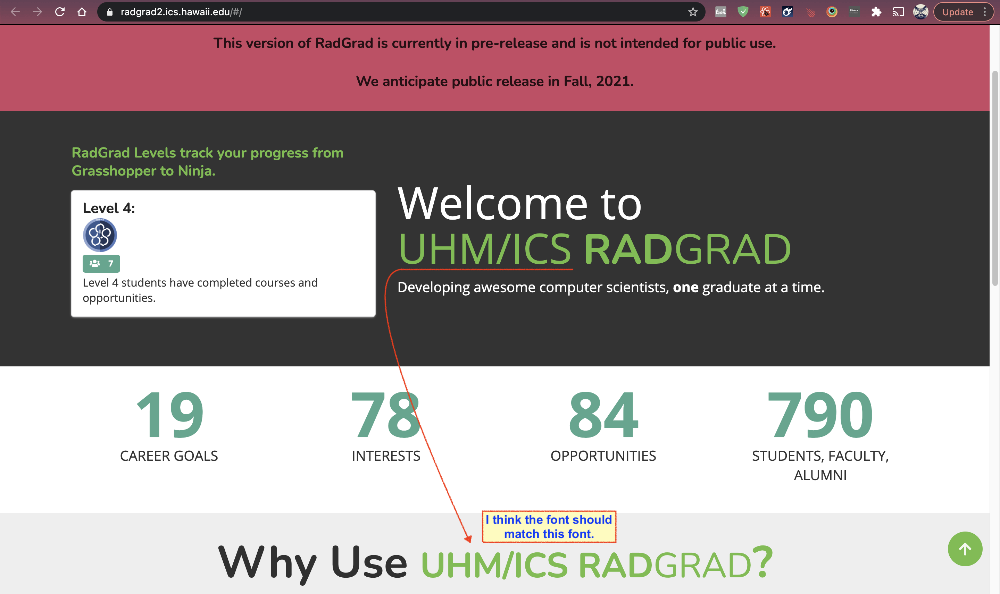

## RadGrad Strengths
Personally these are the three biggest strengths of Radgrad that I found while using the system:
1. It provides the student/user with most and if not all of the things they need to build their portfolio/skills. (A one stop shop)
RadGrad provides students with reviews of courses, an academic planner, and opportunities such as internships tailored to their interests. I think that RadGrad minimizes the need to google reviews on courses and opportunities. It allows students to get it done all in one place.

2. It provides goals for students to achieve.
I think that RadGrad removes the guesswork, of having to figure out how many internships or clubs are enough to be a good candidate for jobs in the future. Radgrad provides students with this information through ICE points.

3. RadGrad is easy to use.
In general Radgrad is an easy application to use. I like that I don’t have to look at a tutorial to use the website.

## RadGrad Weaknesses
1. Its hard to get students to consistently use RadGrad. 
One of my personal experiences with RadGrad is that I only used it for half a semester as a freshmen. I think that at the time the opportunities with RadGrad were not fully articulated or explained. My advisor never pushed me to use it, so I didn’t.

2. There’s a lot of bugs. 
RadGrad currently has a lot of bugs which make it the site slightly hard to use. Despite this I think the overall experience was not too bad.

3. The current layout does not work in a smaller window size.
Currently RadGrad does not fully work in smaller window sizes which to me is a definite downside.

## Impressions of the Lannding Page 

### Styling
*Style Rating: 3.5/5* 

Overall, I think the styling of the landing page is pleasant. Its short, clean and concise. The various shades of green chosen for the color scheme help contribute to the clean look. I also like that after listing the facts, the website prompts the user to get started, get more information, or browse the explorers. So all in all the layout is very pleasing. However, I think there still could be styling improvements to improve the landing page. 

### The Window Size

When changing the window size the landing page begins to look a little broken. The boxes at the bottom are not uniformly sized and the slide show/carousel loses some padding. Also the heading text “Welcome to UHM/ICS RadGrad” is cut off. As a user of the website I don’t always want to feel forced to keep the window at max size.

The image below demonstrates how much I reduced the size of the window. *As a note I am working on a macbook pro with a 13 inch screen.*

### The Font

One minor thing that could be improved is the font. I think the font of UHM/ICS should be kept consistent throughout the landing page. I believe that this is the only instance of the font being different on the landing page. Overall, I think it would make the page slightly more cohesive. 

### Functionality

*Functionality Rating: 3.5/5*

The page in general works pretty well. It loads fast and everything works for the most part (i.e the buttons for the most part provide the respective dropdown).

### The Buttons

One bug I found is that if you click on certain areas of the button the drop down won’t come up and the text disappears (note this is not the case on firefox, instead the text does not disappear, so far only on chrome). Considering that this is the login button, I think it is quite crucial to make sure that this works completely. This goes for the buttons at the bottom of the page. As a side note I have tested this landing page on both firefox and chrome, however I have not tested it on safari. 

  
   

