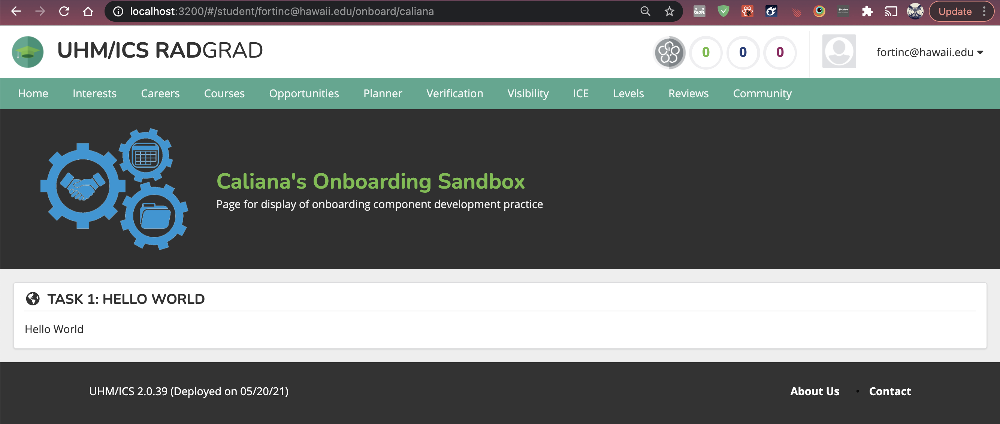

## Task 1

One of the useful tips I learned while working on this task was this one: cmd shift f in the folder you want to search through. This shortcut is extremely helpful when look for examples of how to accomplish a certain task.

Currently I did alright and did not struggle with antyhing during this task. 

