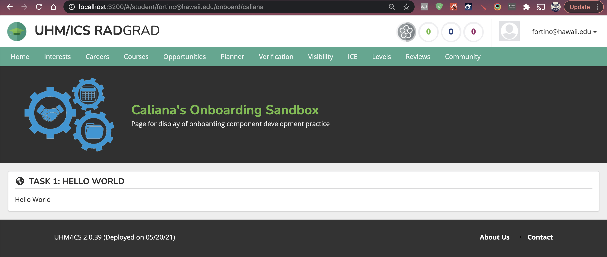
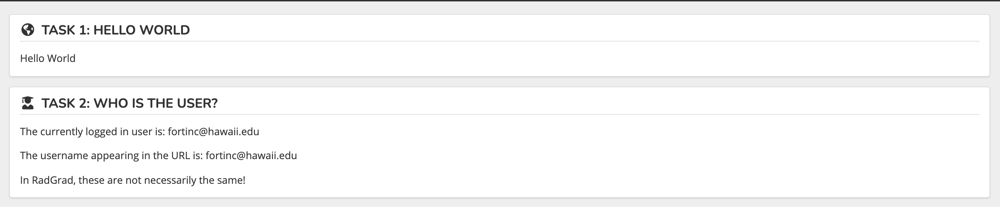
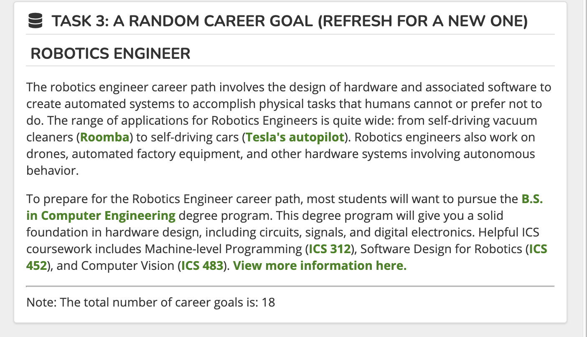

## Task 1: Create a RadGradSegment containing "Hello, World"

### What I learned: 
- One of the useful tips I learned while working on this task was this one: **cmd shift f** in the folder you want to search through. 
  - This shortcut is extremely helpful when looking for examples of how to accomplish a certain task.

### Struggles: 
- I did alright and did not struggle with antyhing during this task. 

## Task 2: Create a RadGradSegment containing the current user

### What I learned: 
From previous projects I already knew how to grab the username of the user using Meteor.user(), so the first part of the task wasn't too hard. However, I was not too sure how to grab the username appearing in the URL. I had decided to refer to my other teamates' essays about how they solved this task. A lot of them mentioned using useParams() from ReactRouters. 

- Basically, useParams() is returns an object of the params for the route rendered. More about useParams() can be found [here](https://reach.tech/router/api/useParams) and [here](https://reactrouter.com/web/api/Hooks).

- Another great tip for doing this is again using the shortcut **cmd shift f** to find examples of how useParams() was used. 

- The final code I ended up writting to get the user name looked like this:
`const { username } = useParams();`

### Struggles: 
- I initially struggled with finding out how to grab the username appearing in the URL. 

## Task 3: Create a RadGradSegment presenting MiniMongo data

### What I learned/ Struggles: 
Task 3 wasn't too hard. I knew that in order to randomize the careerGoals I needed an array of career goals to randomize. From previous projects, I had used underscore's .sample to randomize the chosen value from an array, however I don't think Radgrad is using underscore so I had to look for another way to randomize input from an array. The solution I found came from this link: https://stackoverflow.com/questions/9286473/whats-the-equivalent-of-sample-in-javascript

Another thing I needed to know was how to actually get the data needed to randomize. I decided to consult my teamates' essays. I noticed that they used CareerGoalBrowserViewPage.tsx as an example to follow, so I decided to take a look. CareerGoalBrowserViewPage.tsx uses something called interface to accces some of the properties of their objects. 

According to [typescript documentation](https://www.typescriptlang.org/docs/handbook/2/objects.html) an interface is simply a way to represent object types. An interface allows us to name the object. 

In this case I decided to name the object Task3CareerGoalsProps the object looked something like this: 
- `interface Task3CareerGoalsProps {
  careerGoals: CareerGoal[];
}`
- `careerGoals` is the singleton instance of this class from the CareerGoalsCollection api 
- `CareerGoal[]` was an array which holds all of the career goals in the database. 

The third thing I needed to know was what is this `React.FC` thing? I've never used this any of my previous projects so I decided to look it up. According to this website https://fettblog.eu/typescript-react-why-i-dont-use-react-fc/ , since react was not written in Typescript a package from the community was provided calles @types/react. FC is a generic type that is used to create function components. 

From a lot of examples I am seeing inside these  `<...>` brackets we put the object name. 
- [good resource for typescript](https://react-typescript-cheatsheet.netlify.app/)

