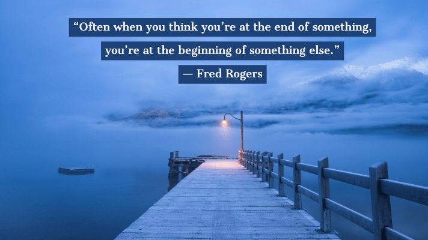

## The end of the beginning

Before taking this class I was quite new to the process of app development. I did not know what was needed to create a website or how to utilize a simple div. I was actually quite worried that I would not be able to create an app or even a website for that matter. However, ICS 314 allowed me to gain many valuable skills that not only can be used to develop an app but also in real life. 

## Organization is a Life Skill

 > “Clutter is not just physical stuff. It’s old ideas, toxic relationships, and bad habits. Clutter is anything that does not support your better self.” – Eleanor Brown

Coding Standards are basically a set of coding rules, guidelines, and best practices. An example of coding standards is the indentation of code, or the way variables are named. This concept is honestly one of the most important things I learned from this class. Not only is the concept of Coding Standards applicable to programming, but I believe it can also be applied to real life. The main goal of Coding Standards is to improve the quality of code by using a set of guidelines, and practices, which I think is applicable to real life. I believe that living a cluttered life affects the quality of living, thus one way to improve the quality of living is by getting rid of bad habits and setting guidelines for daily life. The enforcing of a guideline or rule helps to build discipline, thus improving our lives. Overall, similar to how coding standards make coding easier, organization makes life easier.

## A Stress Reliever 

Another, concept that I will practice in the future is Agile Project Management. Before starting this class, I had no experience with working in a group on a significant computer science project. I was lost about how to communicate with others about the things we needed to get done, or the stuff we should start on. However, as I learned Agile Project Management it made this process a breeze. In class, we utilized the Agile project management process called Issue Driven Project Management or IDPM. Basically, this process required that the tasks of the project be put into issues that could be finished in 2-3 days’ time. IDPM also recommends that each member have one issue that they are currently working on. In my strong belief, IDPM is not only a great skill for a Software Engineer to have but also for other people. IDPM provides a great guideline for how to tackle big projects in a group. I think that IDPM is especially useful during this time of the Covid19 pandemic. Since social interaction was limited everything was moved to an online format. Personally, for me, the online format was quite difficult to be in while trying to manage a group. Nevertheless, IDPM helped to ease the stress of managing a group in an online format. Overall, I believe that IDPM gives people the ability to not only run a group but to run a successful group and project. Now, that I have learned about IDPM I honestly feel ready for any group project that I might encounter in the near future, and for me, that’s a stress reliever. 

## The End? 

Although this is the end of ICS 314, I know I will apply the concepts I learned in this class to many of the real-life situations that I may encounter in the future. This class gave me the confidence to begin new projects, whether it be computer science-related or not, so this is not the end but rather the beginning.
