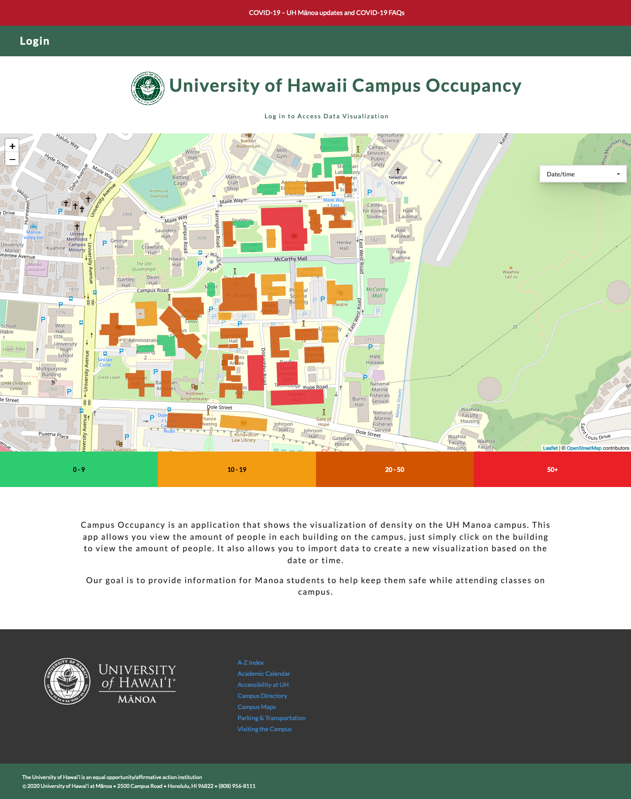
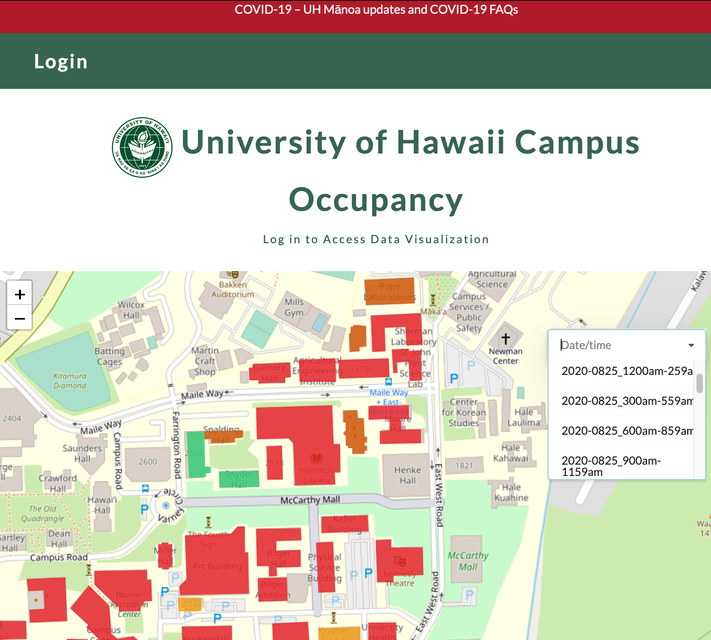

The idea for this project came from the HACC 2020 challenge. My HACC team consisted of <a href="https://fredstraub.github.io"> Fred Straub </a> and <a href="https://buccatm.github.io/"> Marcos Buccat </a>. We chose to tackle the campus visualization issue. However, due to time constraints we were unable to finish the project in time for the competion despite this we decided to push on and use this as our final project.

## Features

The Campus Occupany application features a landing page which allows the user to see a map of the UH campus, and the occupancy of people in each of the buildings. A legend is provided at the bottom of the map to help the user decipher which of the buildings are most occupied. Green buildings are less occupied and red building are very occupied. Not only is the user able to see this visualization, but they are also able to see the visualtions of other dates and times. Simply just click in the drop down menu and select the date/time you would like to view. 

When a user creates an account they are able to view a data page. This data page allows them to view the data of occupancy in a table format. They are also able to access an import data page which allows them to import their data to create a new visualization. 

## What I learned:

I learned a lot from this project. Due to the pandemic all the classes were moved online. This made it difficult to work in a group. However, this experience allowed me to learn about how to work in a group project entirely online. I was able to find and utilize new tools in a different way so we all could work efficiently in a group. Our group utilized Discord to meet up and solve new issues about our project. 

From this project, I gained a lot more technical experience. One of the biggest challenges of this project was simply getting the map to work with our data collection. I had to learn how to ask smart questions to get efficient help and how to utilize google to my full advantage. This was one of the hardest challenges to overcome, but after completing this project I feel more confident about working with collections and visualizations such as maps. 

## Future Plans 

I personally plan to take the experience that I learned from doing this project and apply it some of my future projects. I don't plan on making any additions this project, but maybe in the near future I will try to rework some features on my own to make it more accurate. For instance, one of the main things I want to try to implement in the future is to use the square footage of the building to create a more accurate representation of occupancy. Overall, I am quite happy with the final product.  

## Project

You can visit my project here: 
GitHub Repository: <a href="https://github.com/campus-occupancy/campus-occupancy">Campus Occupancy Application</a>

GitHub IO: <a href="https://campus-occupancy.github.io/">Campus Occupancy Documentation</a>

