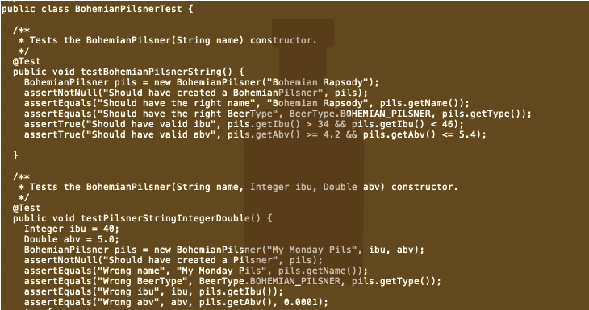

For this project I implemented a beer sorter that sorted the beer based on the IBU and ABV. The user was to enter a beer specifying the type which could be Indian Pale Ale, Bohemian Pilsner, and Pilsner. Next, the user entered the IBU and ABV of the beer. The list then took the beer and sorted them in ascending order. Most of the code was implemented by me however the TA provided some code to help with the implementation of some functions such as the beer type and user interface.

## What I learned:

Although the class was difficult, from this project I learned how to implement data structures using Java. I learned how to implement a sorter using nodes and loops. This project helped me to understand ADTs and object oriented programming and how to apply it to a real world problem. Overall this project really helped me to learn about the problem solving process. 

## Future Plans:

I plan to add a menu and more features of sorting. I want to try implementing different sorting techniques, such as bubble sort and insertion sort. This project really helped to expand my understanding of objects and classes in Java. I hope to apply what I learned to other projects I plan to do.

Source: <a href="https://github.com/CalianaFortin/ICS-211-project"><i class="large github icon "></i>ICS211-BeerSorter</a>

