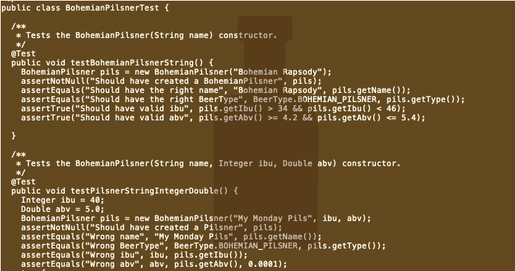

The idea for this project came from the HACC 2020 challenge. My team and I chose to tackle the campus visualization issue. However, due to time constraints we were unable to finish the projec in time for the competion however, despite this we decided to push on and use this as our final project.

##Features

## What I learned:

Although the class was difficult, from this project I learned how to implement data structures using Java. I learned how to implement a sorter using nodes and loops. This project helped me to understand ADTs and object oriented programming and how to apply it to a real world problem. Overall this project really helped me to learn about the problem solving process. 

## Future Plans:

I plan to add a menu and more features of sorting. I want to try implementing different sorting techniques, such as bubble sort and insertion sort. This project really helped to expand my understanding of objects and classes in Java. I hope to apply what I learned to other projects I plan to do.

Source: <a href="https://github.com/CalianaFortin/ICS-211-project"><i class="large github icon "></i>ICS211-BeerSorter</a>

